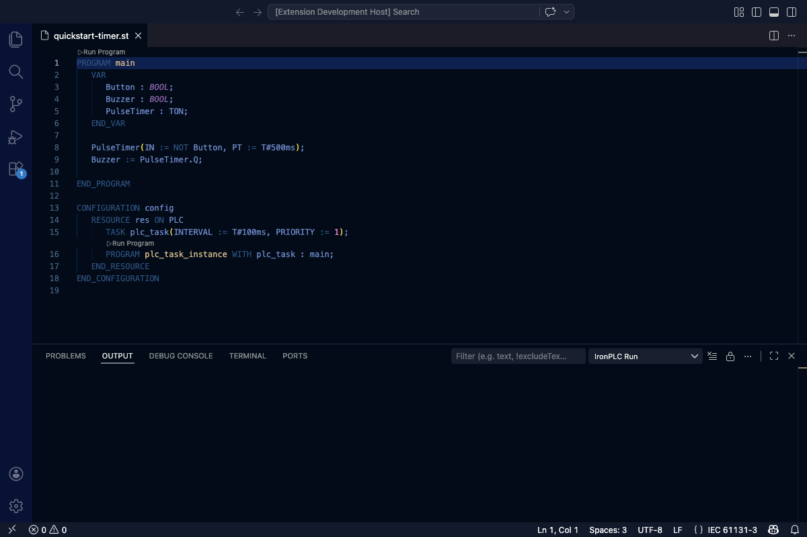

# IronPLC

IronPLC provides IEC 61131-3 Structured Text language support for VS Code.
Get real-time error checking, syntax highlighting, and build tools for PLC
programs — no proprietary IDE required.

## Quick Start

1. [Install the IronPLC compiler and extension](https://www.ironplc.com/quickstart/installation.html)
2. Open or create a `.st` file and start coding

See the [quick start tutorial](https://www.ironplc.com/quickstart/index.html)
to write your first PLC program.

## Capabilities

* [**Real-time diagnostics**](https://www.ironplc.com/reference/editor/overview.html) — syntax and semantic errors reported as you type
* [**Syntax highlighting**](https://www.ironplc.com/reference/compiler/source-formats/index.html) — Structured Text and PLCopen XML files
* [**Build and run**](https://www.ironplc.com/reference/editor/build-tasks.html) — compile and execute programs from the editor
* [**Bytecode viewer**](https://www.ironplc.com/reference/editor/bytecode-viewer.html) — inspect compiled programs

Works with Structured Text (`.st`, `.iec`) and PLCopen XML files,
including the PLCopen XML-based `.TcPOU`, `.TcGVL`, and `.TcDUT` formats.

## Learn More

* [Documentation](https://www.ironplc.com)
* [Playground](https://playground.ironplc.com)
* [Troubleshooting](https://www.ironplc.com/how-to-guides/troubleshoot-editor.html)
* [Source](https://github.com/ironplc/ironplc)

## Trademarks

IronPLC is an independent open-source project. It is not affiliated with,
endorsed by, or sponsored by any third party. TwinCAT is a trademark of
Beckhoff Automation GmbH & Co. KG. CODESYS is a trademark of CODESYS GmbH.
PLCopen is a trademark of PLCopen. All other trademarks are the property
of their respective owners. References to these names in this extension
are descriptive only — they indicate file formats and compatibility modes
that the extension can read.
