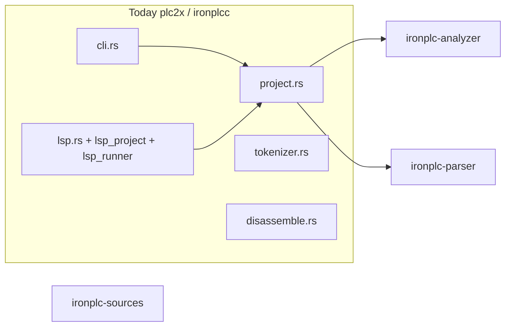
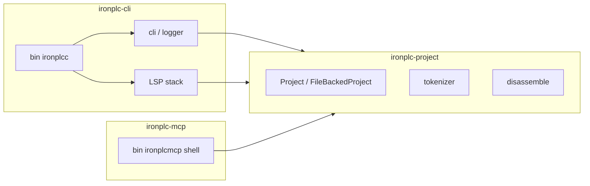

# Split `plc2x` into `ironplc-project`, `ironplc-cli`, and `ironplc-mcp` (shell)

## Current state

- Directory: `compiler/plc2x/` (legacy name).
- Cargo **package** name is already `ironplcc` (not `plc2x`); binary name is `ironplcc` via `[[bin]]`.
- Library surface in `compiler/plc2x/src/lib.rs`: `cli`, `disassemble`, `logger`, `lsp`, `lsp_project`, `lsp_runner`, `project`, `tokenizer`.
- **No other workspace crate** lists `ironplcc` in `Cargo.toml` — only the binary and docs reference it.

## Target layout

| Crate (package name) | Path                        | Role                                                                                                                                                                                                 |
| -------------------- | --------------------------- | ---------------------------------------------------------------------------------------------------------------------------------------------------------------------------------------------------- |
| `ironplc-project`    | `compiler/ironplc-project/` | Library: `Project` trait, `FileBackedProject`, `tokenizer.rs`, and `disassemble.rs` (IPLC → JSON for LSP, MCP, tooling). |
| `ironplc-cli`        | `compiler/ironplc-cli/`     | Library + binary: everything else from today’s crate; **binary name stays `ironplcc`**. |
| `ironplc-mcp`        | `compiler/ironplc-mcp/`     | Binary-only **shell**: package name `ironplc-mcp`, binary **`ironplcmcp`**, depends on **`ironplc-project`** (no MCP SDK yet; stub `main`). |

**Why `tokenizer` moves with project:** It is built around `FileBackedProject` and is invoked from `cli.rs` for the `tokenize` subcommand — same logical layer as `Project`.

**Why `disassemble` moves with project:** Container/bytecode introspection with no LSP or CLI coupling. Placing it in `ironplc-project` lets **`ironplcmcp`** (and LSP) share the same API without `ironplc-cli`-only code.

**`ironplc-mcp` (in scope, shell):** New workspace crate with **`[[bin]] name = "ironplcmcp"`**. Depends only on **`ironplc-project`** for now. Minimal placeholder `main`; real MCP SDK and tools are follow-up.

**What stays in `ironplc-cli`:** `cli.rs`, `logger.rs`, `lsp.rs`, `lsp_project.rs`, `lsp_runner.rs`, `bin/main.rs`, integration tests, and `resources/test/`.

**LSP wiring after the move:** `lsp.rs` handlers use `ironplc_project::disassemble`.

**Imports:** `bin/main.rs` uses `ironplc_cli::` (package `ironplc-cli` → crate `ironplc_cli`).

## `ironplc-project` dependencies

- From `project.rs` / `tokenizer.rs`: `ironplc-analyzer`, `ironplc-dsl`, `ironplc-parser`, `ironplc-problems`, `ironplc-sources`, `log`
- From `disassemble.rs`: `ironplc-container`, `serde_json`
- Forward **`trace`** feature to `ironplc-parser/trace`.

**Not** in this crate: `plc2plc`, `codespan-reporting`, `clap`, `lsp-*`, `codegen`, `vm`.

## `ironplc-cli` package metadata

- **Package name:** `ironplc-cli`
- **Binary name:** `ironplcc` (unchanged for `justfile` / CI artifacts).
- **Dependencies:** `ironplc-project` path dep; trim direct deps that only served moved code where possible.

## Workspace and mechanical updates

1. Add `ironplc-project`, `ironplc-cli`, and `ironplc-mcp` to `compiler/Cargo.toml` `members`; remove `plc2x`.
2. Move/rename `compiler/plc2x/` → `compiler/ironplc-cli/`.
3. Internal references: `ironplc_project::` for project, tokenizer, disassemble.
4. **`cargo test -p ironplcc`** → **`cargo test -p ironplc-cli`**; disassembly tests run under **`cargo test -p ironplc-project -- disassemble`**.

## Verification

- `cd compiler && just`
- `cargo build -p ironplc-cli` → `ironplcc`; `cargo build -p ironplc-mcp` → `ironplcmcp`

## `ironplc-mcp` (shell) details

- **Package name:** `ironplc-mcp` (crate `ironplc_mcp`).
- **Binary name:** `ironplcmcp`.
- **Dependencies:** `ironplc-project` only.
- **Release tarballs:** Optional to add `ironplcmcp` to `justfile` packages later.

## Follow-up (out of scope)

- Real MCP server: SDK, stdio, tools/resources, tests.
